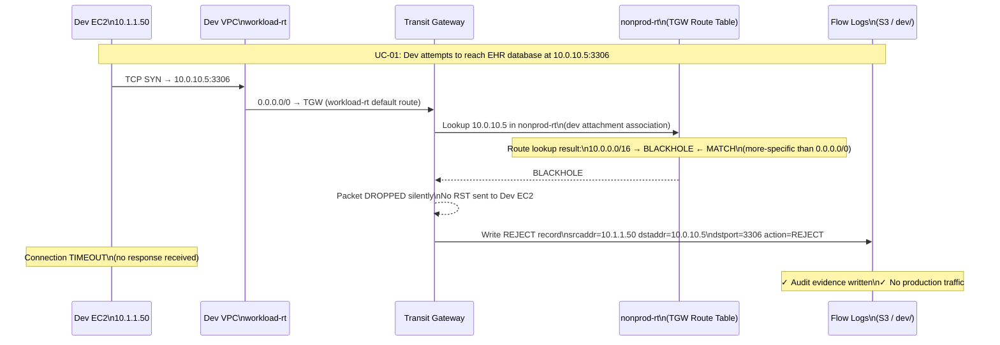
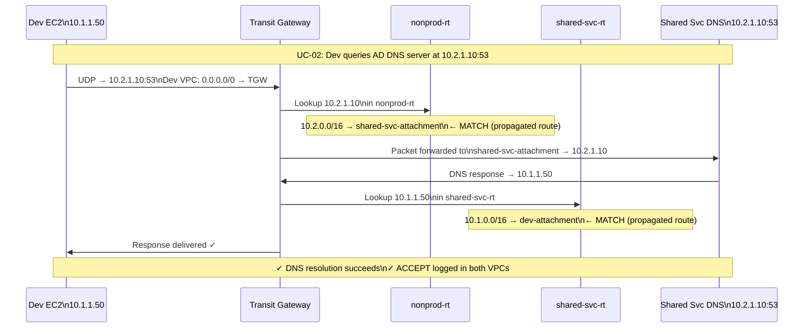
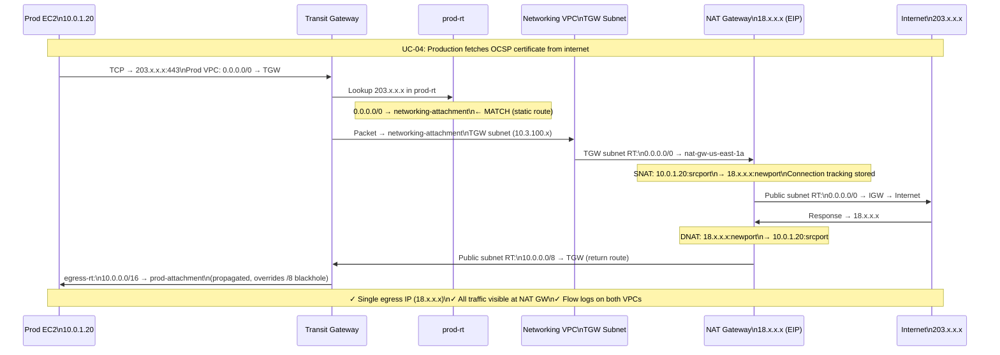
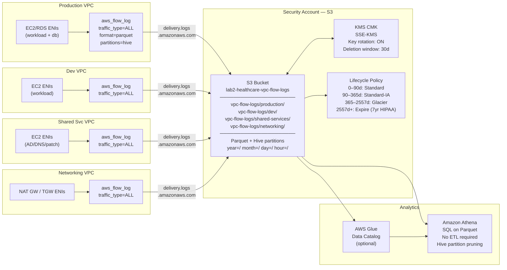

# AWS Native Architecture Diagram with Traffic Flows
## Lab 2 — Transit Gateway Network Segmentation

---

> **Rendering note:** Mermaid diagrams render natively in GitHub, GitLab, VS Code (with Mermaid extension), Confluence (Mermaid plugin), and Notion. ASCII fallbacks are provided for all environments.

---

## Diagram 1 — Full AWS Architecture Overview

```mermaid
graph TB
    subgraph AWS_Region["AWS Region: us-east-1"]
        subgraph TGW_Layer["Transit Gateway Layer"]
            TGW[("🔀 Transit Gateway\nlab2-healthcare-tgw\nASN: 64512")]
            
            subgraph Route_Tables["TGW Route Tables"]
                PROD_RT["prod-rt\n─────────────\n10.0.0.0/16 → prod-att\n10.2.0.0/16 → shared-att\n10.3.0.0/16 → net-att\n0.0.0.0/0 → net-att\n⛔ 10.1.0.0/16 BLACKHOLE"]
                NONPROD_RT["nonprod-rt\n─────────────\n10.1.0.0/16 → dev-att\n10.2.0.0/16 → shared-att\n10.3.0.0/16 → net-att\n0.0.0.0/0 → net-att\n⛔ 10.0.0.0/16 BLACKHOLE"]
                SHARED_RT["shared-svc-rt\n─────────────\n10.0.0.0/16 → prod-att\n10.1.0.0/16 → dev-att\n10.2.0.0/16 → shared-att\n10.3.0.0/16 → net-att\n0.0.0.0/0 → net-att"]
                EGRESS_RT["egress-rt\n─────────────\n10.0.0.0/16 → prod-att\n10.1.0.0/16 → dev-att\n10.2.0.0/16 → shared-att\n⛔ 10.0.0.0/8 BLACKHOLE\n(overridden by /16 routes)"]
                INSPECT_RT["inspection-rt\n─────────────\n(reserved — NFW)"]
            end
        end

        subgraph PROD_VPC["Production VPC — 10.0.0.0/16"]
            PROD_WORKLOAD["App Tier\n10.0.1.0/24 (1a)\n10.0.2.0/24 (1b)\n────────────\nEC2: EHR App\nECS: Services"]
            PROD_DB["DB Tier\n10.0.10.0/24 (1a)\n10.0.11.0/24 (1b)\n────────────\nRDS: EHR Database\nElastiCache"]
            PROD_TGW_SUB["TGW Attach Subnet\n10.0.100.0/28 (1a)\n10.0.100.16/28 (1b)"]
            PROD_ATT[/"prod-attachment"/]
        end

        subgraph DEV_VPC["Dev VPC — 10.1.0.0/16"]
            DEV_WORKLOAD["Workload Tier\n10.1.1.0/24 (1a)\n10.1.2.0/24 (1b)\n────────────\nEC2: Dev Instances\nCI/CD Runners"]
            DEV_TGW_SUB["TGW Attach Subnet\n10.1.100.0/28 (1a)\n10.1.100.16/28 (1b)"]
            DEV_ATT[/"dev-attachment"/]
        end

        subgraph SHARED_VPC["Shared Services VPC — 10.2.0.0/16"]
            SHARED_WORKLOAD["Services Tier\n10.2.1.0/24 (1a)\n10.2.2.0/24 (1b)\n────────────\nActive Directory\nDNS / Route 53 Resolver\nPatch Management"]
            SHARED_TGW_SUB["TGW Attach Subnet\n10.2.100.0/28 (1a)\n10.2.100.16/28 (1b)"]
            SHARED_ATT[/"shared-svc-attachment"/]
        end

        subgraph NET_VPC["Networking VPC — 10.3.0.0/16"]
            subgraph Public_Subnets["Public Subnets (NAT + IGW)"]
                NAT_GW["🌐 NAT Gateway\n(Elastic IP: 18.x.x.x)\n10.3.1.0/24 (1a)"]
                IGW["Internet Gateway"]
            end
            NET_TGW_SUB["TGW Attach Subnet\n10.3.100.0/28 (1a)\n10.3.100.16/28 (1b)"]
            NET_ATT[/"networking-attachment"/]
        end

        subgraph SECURITY_ACCOUNT["Security Account (Simulated)"]
            S3["🗄️ S3 Bucket\nlab2-healthcare-vpc-flow-logs\n──────────────────\nParquet + Hive partitions\nKMS CMK encrypted\n7-year HIPAA retention"]
            KMS["🔑 KMS CMK\nlab2-healthcare-flow-logs-key\nKey rotation: enabled"]
        end
    end

    INTERNET[("🌍 Internet")]

    %% TGW Attachments
    PROD_TGW_SUB --> PROD_ATT
    DEV_TGW_SUB --> DEV_ATT
    SHARED_TGW_SUB --> SHARED_ATT
    NET_TGW_SUB --> NET_ATT

    %% TGW RT Associations
    PROD_ATT -. "associated with" .-> PROD_RT
    DEV_ATT -. "associated with" .-> NONPROD_RT
    SHARED_ATT -. "associated with" .-> SHARED_RT
    NET_ATT -. "associated with" .-> EGRESS_RT

    %% Internet
    IGW <--> INTERNET
    NAT_GW --> IGW

    %% Flow logs
    PROD_VPC -.->|"Flow logs"| S3
    DEV_VPC -.->|"Flow logs"| S3
    SHARED_VPC -.->|"Flow logs"| S3
    NET_VPC -.->|"Flow logs"| S3
    S3 --> KMS

    %% Styling
    classDef vpcBox fill:#E8F4FD,stroke:#2471A3,stroke-width:2px
    classDef tgwBox fill:#FEF9E7,stroke:#B7950B,stroke-width:2px
    classDef secBox fill:#FDEDEC,stroke:#922B21,stroke-width:2px
    classDef rtBox fill:#EBF5FB,stroke:#1A5276,stroke-width:1px,font-size:11px
    class PROD_VPC,DEV_VPC,SHARED_VPC vpcBox
    class NET_VPC tgwBox
    class SECURITY_ACCOUNT secBox
    class PROD_RT,NONPROD_RT,SHARED_RT,EGRESS_RT,INSPECT_RT rtBox
```



---

## Diagram 2 — Traffic Flow: Dev → Prod (DENIED)



---

## Diagram 3 — Traffic Flow: Dev → Shared Services (PERMITTED)



---

## Diagram 4 — Traffic Flow: Production → Internet (Centralized Egress)



---

## Diagram 5 — Subnet Topology Detail (ASCII — Networking VPC)

```
NETWORKING VPC (10.3.0.0/16)
──────────────────────────────────────────────────────────────────────────
│                                                                        │
│  ┌─────────────────────────────────────────────────────────────────┐  │
│  │  PUBLIC SUBNETS (NAT GW tier)                                   │  │
│  │                                                                 │  │
│  │  10.3.1.0/24 (us-east-1a)      10.3.2.0/24 (us-east-1b)        │  │
│  │  ┌───────────────────┐         ┌───────────────────────┐        │  │
│  │  │  NAT Gateway      │         │  (standby if HA mode) │        │  │
│  │  │  EIP: 18.x.x.x    │         │                       │        │  │
│  │  └─────────┬─────────┘         └───────────────────────┘        │  │
│  │  Route Table: public-rt                                          │  │
│  │    10.3.0.0/16 → local                                          │  │
│  │    0.0.0.0/0   → IGW     ← internet egress                     │  │
│  │    10.0.0.0/8  → TGW     ← return path to spokes               │  │
│  └─────────────────────────────────────────────────────────────────┘  │
│                           │           ▲                                │
│                           ▼           │                                │
│                        ┌──────────────────┐                           │
│                        │  Internet Gateway │                           │
│                        └──────────────────┘                           │
│                                  │                                    │
│                            ◄─────┤──────►                             │
│                              Internet                                  │
│                                                                        │
│  ┌─────────────────────────────────────────────────────────────────┐  │
│  │  TGW ATTACHMENT SUBNETS (/28 — TGW ENIs only)                   │  │
│  │                                                                 │  │
│  │  10.3.100.0/28 (us-east-1a)    10.3.100.16/28 (us-east-1b)     │  │
│  │  ┌────────────────────┐        ┌────────────────────────┐       │  │
│  │  │  TGW ENI           │        │  TGW ENI               │       │  │
│  │  │  (networking att.) │        │  (networking att.)     │       │  │
│  │  └──────────┬─────────┘        └────────────────────────┘       │  │
│  │  Route Table: tgw-rt-us-east-1a                                 │  │
│  │    10.3.0.0/16 → local                                          │  │
│  │    0.0.0.0/0   → nat-gw-us-east-1a  ← forward to NAT           │  │
│  └─────────────────────────────────────────────────────────────────┘  │
│                           │                                            │
│                           ▼                                            │
│                    Transit Gateway                                     │
│                    networking-attachment ──→ egress-rt                 │
──────────────────────────────────────────────────────────────────────────
```

---

## Diagram 6 — TGW Route Table Segmentation (ASCII — Policy View)

```
┌──────────────────────────────────────────────────────────────────────────────┐
│                         TRANSIT GATEWAY POLICY PLANE                         │
│                                                                              │
│   ATTACHMENT          ASSOCIATION          KEY ROUTES IN ASSOCIATED RT       │
│   ─────────────────────────────────────────────────────────────────────────  │
│                                                                              │
│   prod-attachment ──→ prod-rt              10.0.0.0/16 → prod (propagated)   │
│      (10.0.0.0/16)                         10.2.0.0/16 → shared (propagated) │
│                                            10.3.0.0/16 → net (propagated)    │
│                                            0.0.0.0/0   → net (static)        │
│                                            10.1.0.0/16 → ⛔ BLACKHOLE        │
│                                                                              │
│   dev-attachment  ──→ nonprod-rt           10.1.0.0/16 → dev (propagated)    │
│      (10.1.0.0/16)                         10.2.0.0/16 → shared (propagated) │
│                                            10.3.0.0/16 → net (propagated)    │
│                                            0.0.0.0/0   → net (static)        │
│                                            10.0.0.0/16 → ⛔ BLACKHOLE        │
│                                                                              │
│   shared-svc-att  ──→ shared-svc-rt        10.0.0.0/16 → prod (propagated)   │
│      (10.2.0.0/16)                         10.1.0.0/16 → dev (propagated)    │
│                                            10.2.0.0/16 → shared (propagated) │
│                                            10.3.0.0/16 → net (propagated)    │
│                                            0.0.0.0/0   → net (static)        │
│                                                                              │
│   net-attachment  ──→ egress-rt            10.0.0.0/16 → prod (propagated)   │
│      (10.3.0.0/16)                         10.1.0.0/16 → dev (propagated)    │
│                                            10.2.0.0/16 → shared (propagated) │
│                                            10.3.0.0/16 → net (propagated)    │
│                                            10.0.0.0/8  → ⛔ BLACKHOLE        │
│                                                                              │
│   PROPAGATION MATRIX:                                                        │
│                        prod-rt  nonprod-rt  shared-rt  egress-rt             │
│   prod-attachment         ✓        ✗           ✓          ✓                 │
│   dev-attachment          ✗        ✓           ✓          ✓                 │
│   shared-svc-attachment   ✓        ✓           ✓          ✓                 │
│   net-attachment          ✗        ✗           ✗          ✓                 │
│                                                                              │
│   ✗ = CIDR absent from route table = UNREACHABLE from that segment           │
│   ⛔ = Explicit blackhole (defense-in-depth)                                 │
└──────────────────────────────────────────────────────────────────────────────┘
```

---

## Diagram 7 — Multi-AZ Spoke VPC Topology (ASCII — Production VPC)

```
PRODUCTION VPC (10.0.0.0/16)
──────────────────────────────────────────────────────────────────────────────
│                                                                            │
│           us-east-1a                      us-east-1b                      │
│  ┌─────────────────────────┐    ┌──────────────────────────┐              │
│  │  WORKLOAD SUBNET        │    │  WORKLOAD SUBNET         │              │
│  │  10.0.1.0/24            │    │  10.0.2.0/24             │              │
│  │  ─────────────────────  │    │  ──────────────────────  │              │
│  │  [EC2: EHR App Servers] │    │  [EC2: EHR App Servers]  │              │
│  │  [ECS Tasks]            │    │  [ECS Tasks]             │              │
│  │  RT: workload-rt        │    │  RT: workload-rt         │              │
│  │    0.0.0.0/0 → TGW      │    │    0.0.0.0/0 → TGW      │              │
│  └───────────┬─────────────┘    └──────────────┬───────────┘              │
│              │                                 │                          │
│  ┌───────────▼─────────────┐    ┌──────────────▼───────────┐              │
│  │  DATABASE SUBNET        │    │  DATABASE SUBNET         │              │
│  │  10.0.10.0/24           │    │  10.0.11.0/24            │              │
│  │  ─────────────────────  │    │  ──────────────────────  │              │
│  │  [RDS Primary: EHR DB]  │    │  [RDS Standby]           │              │
│  │  [ElastiCache Primary]  │    │  [ElastiCache Replica]   │              │
│  │  RT: database-rt        │    │  RT: database-rt         │              │
│  │    0.0.0.0/0 → TGW      │    │    0.0.0.0/0 → TGW      │              │
│  └─────────────────────────┘    └──────────────────────────┘              │
│                                                                            │
│  ┌─────────────────────────┐    ┌──────────────────────────┐              │
│  │  TGW ATTACHMENT SUBNET  │    │  TGW ATTACHMENT SUBNET   │              │
│  │  10.0.100.0/28          │    │  10.0.100.16/28          │              │
│  │  ─────────────────────  │    │  ──────────────────────  │              │
│  │  [TGW ENI only]         │    │  [TGW ENI only]          │              │
│  │  RT: tgw-rt (local)     │    │  RT: tgw-rt (local)      │              │
│  └───────────┬─────────────┘    └──────────────┬───────────┘              │
│              └────────────┬─────────────────────┘                         │
│                           ▼                                                │
│                  prod-attachment                                           │
│                  (AWS TGW VPC Attachment)                                  │
│                           │                                                │
│                           ▼                                                │
│                   Transit Gateway                                          │
│                   Association: prod-rt                                     │
──────────────────────────────────────────────────────────────────────────────
```

---

## Diagram 8 — End-to-End Flow Log Architecture



---

## Diagram 9 — Compliance Control Mapping

```
┌─────────────────────────────────────────────────────────────────────────────┐
│                     COMPLIANCE CONTROL COVERAGE MAP                         │
│                                                                             │
│  INFRASTRUCTURE CONTROL           MAPS TO                                  │
│  ─────────────────────────────────────────────────────────────────────────  │
│                                                                             │
│  TGW Route Table Isolation     ──→ HIPAA §164.312(a)(1) Access Control     │
│  (dev cannot reach prod-rt)    ──→ PCI-DSS Req 1.2 Network Controls        │
│                                ──→ NIST 800-207 ZTA Least Privilege         │
│                                ──→ SOX ITGC Logical Access                  │
│                                                                             │
│  Blackhole Routes              ──→ PCI-DSS Req 1.3 Anti-spoofing           │
│  (explicit deny defense layer) ──→ HIPAA Defense-in-Depth                  │
│                                                                             │
│  Centralized Egress (NAT GW)   ──→ PCI-DSS Req 1.3.4 DMZ requirement      │
│                                ──→ NIST 800-207 Single Ingress/Egress       │
│                                                                             │
│  VPC Flow Logs (ALL traffic)   ──→ HIPAA §164.312(b) Audit Controls        │
│                                ──→ PCI-DSS Req 10.2 Audit Events           │
│                                ──→ SOX ITGC Audit Logging                   │
│                                                                             │
│  7-Year S3 Retention           ──→ HIPAA §164.316(b)(2)(i) 6yr minimum    │
│                                ──→ SOX 7-year record retention              │
│                                                                             │
│  KMS CMK Encryption at Rest    ──→ HIPAA §164.312(a)(2)(iv)               │
│                                ──→ PCI-DSS Req 3.5 Protect stored data     │
│                                                                             │
│  Bucket Policy HTTPS-only      ──→ HIPAA §164.312(e)(2)(ii) Encryption    │
│                                ──→ PCI-DSS Req 4.2 Transmission security   │
│                                                                             │
│  Terraform IaC (all changes)   ──→ SOX Change Management ITGC             │
│                                ──→ NIST 800-207 Verified Changes            │
│                                ──→ PCI-DSS Req 6.4 Change Control          │
└─────────────────────────────────────────────────────────────────────────────┘
```

---

## Diagram 10 — Future State: Inline Inspection Extension

```
Current State (Lab 2):
  Spoke VPC → TGW (spoke-rt) → [blackhole or forward] → destination

Future State (inline NFW):
  Spoke VPC → TGW (spoke-rt) → inspection-rt → NFW VPC
                                              → NFW Policy Evaluation
                                              ↓ (if PERMIT)
                                              → TGW (post-inspection-rt)
                                              → destination

AWS Services Added:
  ┌──────────────────────────────────────────────────────────────────────┐
  │  AWS Network Firewall (NFW)                                          │
  │    - Suricata-compatible rule groups                                 │
  │    - Stateful domain filtering (block exfil to unknown domains)      │
  │    - Stateless rate limiting                                         │
  │    - Alert mode first → deny mode after tuning                       │
  │                                                                      │
  │  Inspection VPC (new):                                               │
  │    - NFW endpoints in TGW attachment subnets                         │
  │    - Gateway Load Balancer optional (3rd-party IDS/IPS appliances)  │
  │    - inspection-rt in TGW already provisioned — no TGW changes       │
  └──────────────────────────────────────────────────────────────────────┘

  This is a ZERO-CHANGE to spoke VPCs. Only TGW static routes change
  to redirect traffic through inspection-rt instead of direct forward.
```
